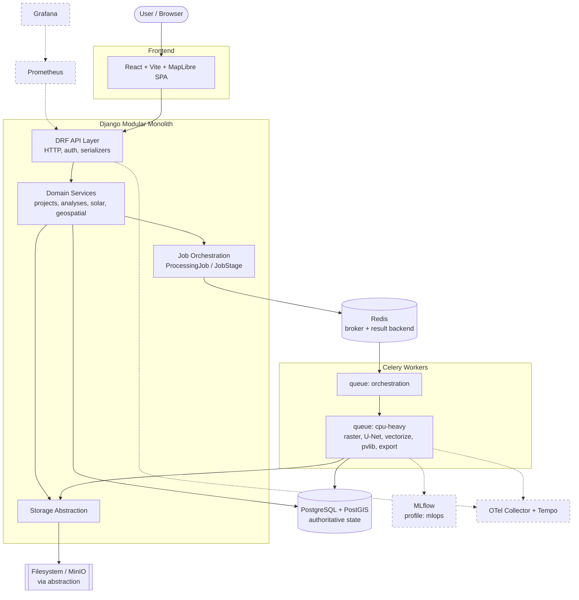

# System Architecture — Rooftop Energy Estimator

Phase 2 (Architecture). Solution Architect deliverable. Authoritative for component
boundaries, topology, async orchestration, storage abstraction, deployment, and CI/CD.
Internal module design is out of scope (Software Architect).

## Architectural Drivers

1. **Zero-cost, offline-capable (§3)** — Core workflow must run at €0 locally with no cloud
   account, no GPU, no internet after setup. Drives: self-hosted everything, CPU default
   path, optional profiles, no managed services.
2. **Modular monolith (§5, DEC-07)** — Single Django deployable with async workers. No
   microservices, no Kafka, no required k8s. Drives: one codebase, clear internal seams.
3. **Heavy work off the request path (§17)** — Image processing and U-Net inference must
   never run in HTTP handlers. Drives: Celery + Redis, durable job state.
4. **Authoritative job state in PostgreSQL (§17)** — Not Redis. Drives: `ProcessingJob` /
   `JobStage` tables are the source of truth; Redis is only broker/result transport.
5. **Reproducibility (DEC-09)** — Each Analysis freezes assumptions, model version, method
   version, code commit, imagery metadata. Drives: immutable snapshot entities.
6. **Storage portability (§4, DEC-07)** — Filesystem now, S3-compatible later without domain
   changes. Drives: storage abstraction interface.
7. **Free-tier CI, no untrusted PR execution (§27)** — Drives: cached GitHub Actions,
   cancel-superseded, CPU-only ML tests.

## 1. System Context and Components



### Component Catalog

| Component | Responsibility | Technology | Notes |
|-----------|----------------|------------|-------|
| Frontend SPA | Presentation, map interaction, forms, charts | React, TS strict, Vite, MUI, MapLibre, TanStack Query, Zod, Recharts | Served by nginx (prod) / Vite dev server (local) |
| DRF API layer | HTTP, authn/authz, (de)serialization, OpenAPI | Django, DRF, django-filter, drf-spectacular | Thin; no domain logic (§5) |
| Domain services | projects, analyses, solar (pvlib), geospatial, imagery, exports | Python packages under `apps/*/services` | Provider interfaces; not in views/tasks/models |
| Job orchestration | Create/track jobs, stage progress, cancellation | Django models `ProcessingJob`/`JobStage` | State authority = PostgreSQL |
| Storage abstraction | Read/write/delete artifacts and rasters | Custom interface (see §4) | filesystem default, S3/MinIO adapter |
| Celery workers | Execute pipeline stages off request path | Celery, TensorFlow (CPU), rasterio, GeoPandas, pvlib | Two queues (see §3) |
| PostgreSQL+PostGIS | Persistence + spatial + job state | postgis/postgis:16 | Explicit SRIDs |
| Redis | Celery broker + result backend | redis:7 | Transport only, never authoritative |
| MLflow (opt) | Local experiment tracking / model registry | mlflow | profile `mlops` |
| Prometheus/Grafana/OTel (opt) | Metrics, dashboards, traces | prometheus, grafana, otel-collector, tempo | profile `observability` |

### Separation of concerns (§5) — mapped to apps

`accounts` (authn/authz) · `projects` · `analyses` (orchestration entrypoints) ·
`geospatial` (raster + vector) · `imagery` (provider interfaces) · `solar` (pvlib) ·
`ml_models` (inference + versions) · `jobs` (async orchestration) · `exports`.

## 2. Container / Service Topology

All images use non-root users, pinned base tags, and healthchecks. Backend, worker,
and beat share one image (`infrastructure/docker/backend.Dockerfile`).

### BASE profile (`docker compose up --build`)

| Service | Image base | Ports | Volumes | Key env | Healthcheck | User |
|---------|-----------|-------|---------|---------|-------------|------|
| `frontend` | node:20-slim (dev) / nginx:1.27-alpine (prod build) | 5173 (dev) / 8080 | source bind (dev) | `VITE_API_URL` | `wget -q /` | `node`/`nginx` |
| `api` | python:3.12-slim (+GDAL) | 8000 | `media:/app/media`, code bind (dev) | `DATABASE_URL`, `REDIS_URL`, `STORAGE_BACKEND`, `SECRET_KEY`, `DJANGO_SETTINGS_MODULE` | `curl -f /api/health/` | `app` (uid 1000) |
| `worker` | same as api | — | `media:/app/media` | same + `CELERY_QUEUES=orchestration,cpu-heavy` | `celery inspect ping` | `app` |
| `beat` | same as api | — | `celerybeat:/app/beat` | same | process check | `app` |
| `db` | postgis/postgis:16-3.4 | 5432 | `pgdata:/var/lib/postgresql/data` | `POSTGRES_DB/USER/PASSWORD` | `pg_isready` | `postgres` |
| `redis` | redis:7-alpine | 6379 | `redisdata:/data` | — | `redis-cli ping` | `redis` |

`worker` and `beat` are separate services but same image; `beat` only if scheduled
cleanup/retention jobs are enabled. Storage in BASE = filesystem (shared `media` volume).
MinIO is opt-in via `STORAGE_BACKEND=s3` and a `minio` service (profile `storage-s3`).

### OPTIONAL profiles

`--profile mlops`:
| `mlflow` | ghcr.io/mlflow/mlflow:v2 | 5000 | `mlflowdata:/mlflow` | `MLFLOW_BACKEND_STORE_URI` | `curl /health` | non-root |

`--profile observability`:
| `otel-collector` | otel/opentelemetry-collector-contrib | 4317/4318 | config bind | — | — | non-root |
| `prometheus` | prom/prometheus:v2 | 9090 | `promdata`, config bind | — | `wget /-/healthy` | `nobody` |
| `grafana` | grafana/grafana-oss:11 | 3000 | `grafanadata`, provisioning bind | `GF_SECURITY_ADMIN_PASSWORD` | `wget /api/health` | `grafana` |
| `tempo` | grafana/tempo:2 | 3200 | `tempodata`, config bind | — | — | non-root |

Profiles keep the base footprint small (§4, §26). Optional services never required for the
core workflow, tests, or demo.

## 3. Asynchronous Orchestration (§17)

### Queues
- **`orchestration`** — lightweight: create job graph, sequence stages, aggregate results,
  emit progress, run cleanup. Low concurrency, fast.
- **`cpu-heavy`** — raster read/tiling, U-Net inference, polygon extraction, pvlib
  calculation, report/export generation. Bounded concurrency (default 1–2 per worker to
  cap RAM). A future `gpu` queue is reserved but the default path is CPU-only (§17).

### Job state authority = PostgreSQL (not Redis)
`ProcessingJob` (correlation ID, overall status, retry count, cancellation flag, failure
code, user-safe message, internal diagnostics, cleanup status) and `JobStage` (per-stage
status, durable progress %, start/end timestamps). Redis carries only the broker messages
and transient results. Workers write stage transitions transactionally to PostgreSQL so the
API reflects true state even after a Redis flush.

### Stage pipeline (per Analysis)
`ingest_imagery → preprocess/tile → unet_inference → vectorize/repair → solar_estimate →
export`. Each stage: durable progress row, timestamps, observable via OTel span +
correlation ID.

### Reliability controls
- **Idempotency:** each stage keyed by `(analysis_id, stage, model_version, method_version)`
  idempotency key; re-running a completed stage is a no-op returning stored result.
- **Retries:** transient failures (I/O, DB deadlock) retried with exponential backoff and a
  bounded max retry count recorded on the job; deterministic failures fail fast with a
  failure code.
- **Cancellation:** cooperative — workers check the `cancel_requested` flag between stages
  and at coarse checkpoints; state moves to `cancelled` with cleanup.
- **Limits:** Celery `task_time_limit` (hard) + `soft_time_limit` (graceful) per task;
  memory bounded via worker concurrency and batched/windowed raster reads (MUST-ADD).
- **Duplicate execution resistance:** `acks_late=True`, `task_reject_on_worker_lost=True`,
  plus DB idempotency keys.

## 4. Storage Abstraction (§4, DEC-07, ADR-0003)

Single interface in `apps/geospatial` (or a shared `core.storage`) consumed by domain
services; no domain code touches filesystem or boto directly.

```
class ObjectStorage(Protocol):
    def save(key: str, data: bytes | BinaryIO, content_type: str | None) -> str  # returns URI/key
    def open(key: str) -> BinaryIO
    def read_bytes(key: str) -> bytes
    def exists(key: str) -> bool
    def delete(key: str) -> None
    def url(key: str, expires: int | None = None) -> str   # local path or presigned URL
    def list(prefix: str) -> Iterable[str]
    def copy(src_key: str, dst_key: str) -> None
```

Adapters: `FilesystemStorage` (default, `MEDIA_ROOT`) and `S3Storage` (boto3, works with
MinIO or any S3-compatible endpoint). Selected via `STORAGE_BACKEND` env. Keys are opaque
logical paths (`analyses/{id}/rasters/...`) so switching backends needs no domain change.

## 5. Deployment (§28)

- **Local Docker Compose (mandatory):** `docker compose up --build` starts BASE profile.
  Optional `--profile mlops` / `--profile observability` / `--profile storage-s3`.
- **Production:** `infrastructure/docker/*.Dockerfile` (multi-stage, Gunicorn for API,
  nginx-served static frontend, dedicated worker) + `infrastructure/docker/docker-compose.prod.yml`
  example with `.env` reference, resource limits, restart policies.
- **Kubernetes (portfolio only):** manifests/Helm under `infrastructure/kubernetes/` — not
  required for core app; documented as demonstration.
- **Terraform (portfolio only):** examples under `infrastructure/terraform-examples/`.
  **Never executed automatically. CI never runs terraform. Cloud infra can generate charges
  (§3, §28) — warned in COSTS.md and the terraform README.**
- **Runbooks (docs/operations):** env-variable reference, migration procedure, backup +
  restore (pg_dump/pg_restore + storage sync), deployment runbook, rollback runbook, upgrade
  procedure.

## 6. CI/CD Workflows (GitHub Actions, free-tier) (§27)

Each is a job; grouped into a few workflow files with a shared setup. All use dependency
caching (`pip`, `npm`), `concurrency` groups to **cancel superseded runs**, small fixtures,
and CPU-only ML tests. Untrusted PR code is never deployed; scans run without secrets.

1. Python lint (Ruff)
2. Python format check (Ruff format)
3. mypy (backend type check)
4. Backend tests (pytest + pytest-django, PostGIS service container, tiny CI model)
5. Frontend lint (ESLint) + Prettier check
6. TypeScript typecheck (`tsc --noEmit`)
7. Frontend tests (Vitest + RTL)
8. Frontend production build (Vite)
9. Integration tests (API + DB + worker, docker compose)
10. End-to-end tests (Playwright)
11. Migration validation (`makemigrations --check`, migrate on clean DB)
12. Docker image build (buildx + layer cache; build once, reuse)
13. Dependency audit (pip-audit, npm audit)
14. Secret scan (Gitleaks)
15. Container scan (Trivy)

(OWASP ZAP baseline optional/manual, not on every PR.)

## 7. Architecture Decision Records

Full ADRs in `docs/decisions/`:

- ADR-0001 — Modular monolith over microservices
- ADR-0002 — PostgreSQL as authoritative job state (Redis transport only)
- ADR-0003 — Storage abstraction: filesystem default, S3-compatible later
- ADR-0004 — Celery queue separation: orchestration vs cpu-heavy (CPU default)
- ADR-0005 — Optional Docker Compose profiles for MLOps and observability
- ADR-0006 — Model artifact distributed outside git with checksummed download + CI test model
- ADR-0007 — Deterministic CPU sample path; super-resolution and orientation sweep optional

## Infrastructure Requirements

Docker + Docker Compose; PostgreSQL 16 + PostGIS 3.4; Redis 7; Python 3.12 + GDAL/GEOS/PROJ;
Node 20; shared media volume (or MinIO); GitHub Actions runners (free tier). No GPU, no cloud
account required.

## Risk Register

| ID | Risk | Impact | Mitigation |
|----|------|--------|------------|
| R1 | U-Net inference RAM spikes on large rasters | Worker OOM | Windowed reads + batched/bounded tiling (MUST-ADD); low cpu-heavy concurrency; time limits |
| R2 | Redis loss mistaken for job state loss | Wrong status shown | PostgreSQL authoritative; Redis transport only (ADR-0002) |
| R3 | Storage coupling blocks future S3 | Rework | Abstraction interface enforced (ADR-0003) |
| R4 | Optional profiles bloat local footprint | Slow/heavy dev | Profiles off by default; base = 6 services (§26) |
| R5 | 90MB model absent in fresh clone | Broken setup | Checksummed download script + clear error + tiny CI model (DEC-05) |
| R6 | Accidental cloud charges via terraform | Cost | Never auto-run; explicit COSTS.md warning (§3, §28) |
| R7 | CI minutes exceed free tier | Blocked pipeline | Caching, cancel-superseded, build-once, CPU-only tests (§27) |
| R8 | Duplicate task execution corrupts results | Data integrity | Idempotency keys + acks_late + reject-on-lost (§17) |
```
